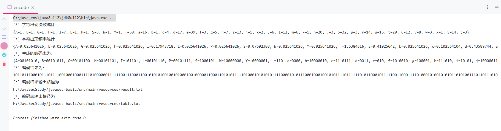
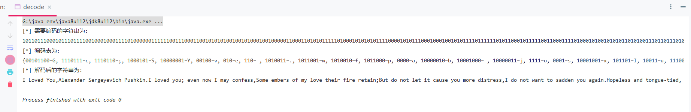

### 基于python的bmp图像的二元霍夫曼编码译码

#### python版本：

1.对一副BMP图像进行二元霍夫曼编码和译码，即要对灰度图像的像素点进行操作，对其进行二元霍夫曼编码  
2.将编码结果以字节形式存入txt文件中，并在译码过程中将编码结果按照编码表进行译码，还原为原始BMP图像

####  java版本：

算法布置作业让写霍夫曼编码译码，正好最近在学习JAVA，因此更新JAVA版本的源程序：
1.encode.java针对指定字符串进行二元霍夫曼编码，并输出编码表以及编码结果  

2.decode.java根据编码结果以及编码表来进行解码  

